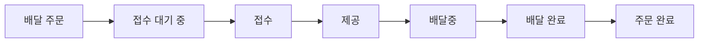
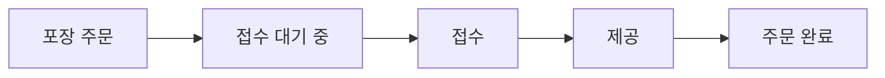
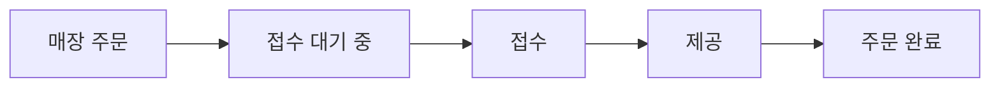

# 키친포스

## 퀵 스타트

```sh
cd docker
docker compose -p kitchenpos up -d
```

## 요구 사항

### 상품

- 상품을 등록할 수 있다.
- 상품의 가격이 올바르지 않으면 등록할 수 없다.
    - 상품의 가격은 0원 이상이어야 한다.
- 상품의 이름이 올바르지 않으면 등록할 수 없다.
    - 상품의 이름에는 비속어가 포함될 수 없다.
- 상품의 가격을 변경할 수 있다.
- 상품의 가격이 올바르지 않으면 변경할 수 없다.
    - 상품의 가격은 0원 이상이어야 한다.
- 상품의 가격이 변경될 때 메뉴의 가격이 메뉴에 속한 상품 금액의 합보다 크면 메뉴가 숨겨진다.
- 상품의 목록을 조회할 수 있다.

### 메뉴 그룹

- 메뉴 그룹을 등록할 수 있다.
- 메뉴 그룹의 이름이 올바르지 않으면 등록할 수 없다.
    - 메뉴 그룹의 이름은 비워 둘 수 없다.
- 메뉴 그룹의 목록을 조회할 수 있다.

### 메뉴

- 1 개 이상의 등록된 상품으로 메뉴를 등록할 수 있다.
- 상품이 없으면 등록할 수 없다.
- 메뉴에 속한 상품의 수량은 0 이상이어야 한다.
- 메뉴의 가격이 올바르지 않으면 등록할 수 없다.
    - 메뉴의 가격은 0원 이상이어야 한다.
- 메뉴에 속한 상품 금액의 합은 메뉴의 가격보다 크거나 같아야 한다.
- 메뉴는 특정 메뉴 그룹에 속해야 한다.
- 메뉴의 이름이 올바르지 않으면 등록할 수 없다.
    - 메뉴의 이름에는 비속어가 포함될 수 없다.
- 메뉴의 가격을 변경할 수 있다.
- 메뉴의 가격이 올바르지 않으면 변경할 수 없다.
    - 메뉴의 가격은 0원 이상이어야 한다.
- 메뉴에 속한 상품 금액의 합은 메뉴의 가격보다 크거나 같아야 한다.
- 메뉴를 노출할 수 있다.
- 메뉴의 가격이 메뉴에 속한 상품 금액의 합보다 높을 경우 메뉴를 노출할 수 없다.
- 메뉴를 숨길 수 있다.
- 메뉴의 목록을 조회할 수 있다.

### 주문 테이블

- 주문 테이블을 등록할 수 있다.
- 주문 테이블의 이름이 올바르지 않으면 등록할 수 없다.
    - 주문 테이블의 이름은 비워 둘 수 없다.
- 빈 테이블을 해지할 수 있다.
- 빈 테이블로 설정할 수 있다.
- 완료되지 않은 주문이 있는 주문 테이블은 빈 테이블로 설정할 수 없다.
- 방문한 손님 수를 변경할 수 있다.
- 방문한 손님 수가 올바르지 않으면 변경할 수 없다.
    - 방문한 손님 수는 0 이상이어야 한다.
- 빈 테이블은 방문한 손님 수를 변경할 수 없다.
- 주문 테이블의 목록을 조회할 수 있다.

### 주문

- 1개 이상의 등록된 메뉴로 배달 주문을 등록할 수 있다.
- 1개 이상의 등록된 메뉴로 포장 주문을 등록할 수 있다.
- 1개 이상의 등록된 메뉴로 매장 주문을 등록할 수 있다.
- 주문 유형이 올바르지 않으면 등록할 수 없다.
- 메뉴가 없으면 등록할 수 없다.
- 매장 주문은 주문 항목의 수량이 0 미만일 수 있다.
- 매장 주문을 제외한 주문의 경우 주문 항목의 수량은 0 이상이어야 한다.
- 배달 주소가 올바르지 않으면 배달 주문을 등록할 수 없다.
    - 배달 주소는 비워 둘 수 없다.
- 빈 테이블에는 매장 주문을 등록할 수 없다.
- 숨겨진 메뉴는 주문할 수 없다.
- 주문한 메뉴의 가격은 실제 메뉴 가격과 일치해야 한다.
- 주문을 접수한다.
- 접수 대기 중인 주문만 접수할 수 있다.
- 배달 주문을 접수되면 배달 대행사를 호출한다.
- 주문을 서빙한다.
- 접수된 주문만 서빙할 수 있다.
- 주문을 배달한다.
- 배달 주문만 배달할 수 있다.
- 서빙된 주문만 배달할 수 있다.
- 주문을 배달 완료한다.
- 배달 중인 주문만 배달 완료할 수 있다.
- 주문을 완료한다.
- 배달 주문의 경우 배달 완료된 주문만 완료할 수 있다.
- 포장 및 매장 주문의 경우 서빙된 주문만 완료할 수 있다.
- 주문 테이블의 모든 매장 주문이 완료되면 빈 테이블로 설정한다.
- 완료되지 않은 매장 주문이 있는 주문 테이블은 빈 테이블로 설정하지 않는다.
- 주문 목록을 조회할 수 있다.

## 용어 사전

### 기타

| 한글명 | 영문명              | 설명                        |
|-----|------------------|---------------------------|
| 사장님 | Restaurant Owner | 상품을 파는 사람이다.              |
| 손님  | Guest            | 상품을 사는 사람이다.              |
| 매장  | Store            | 키친포스가 설치되고 음식을 사고파는 장소이다. |

### 상품

| 한글명   | 영문명              | 설명                               |
|-------|------------------|----------------------------------|
| 상품    | Product          | 매장에서 판매하는 음식이다.                  |
| 상품 가격 | Product Price    | 매장에서 판매하는 음식의 가격이다.              |
| 상품 이름 | Product Name     | 매장에서 판매하는 음식의 이름이다.              |
| 상품 변경 | Product Change   | 상품 가격의 수정, 변경 등을 포괄하는 용어이다.      |
| 상품 목록 | Product List     | 상품의 목록이다.                        |
| 비속어   | Profanity        | 상품의 이름으로 사용될 수 없는 단어이다.          |
| 상품 등록 | Product Register | 새로운 상품을 등록, 추가, 생성 등을 포괄하는 용어이다. |

### 메뉴그룹

| 한글명      | 영문명            | 설명                 |
|----------|----------------|--------------------|
| 메뉴 그룹    | MenuGroup      | 메뉴들의 묶음이다.         |
| 메뉴 그룹 이름 | MenuGroup Name | 메뉴들의 묶음을 칭하는 이름이다. |
| 메뉴 그룹 목록 | MenuGroup List | 메뉴들의 묶음의 목록이다.     |

### 메뉴

| 한글명      | 영문명                   | 설명                 |
|----------|-----------------------|--------------------|
| 메뉴       | Menu                  | 사장님이 팔고 싶은 상품의 구성  |
| 메뉴 이름    | Menu Name             | 메뉴를 칭하는 이름이다.      |
| 메뉴 가격    | Menu Price            | 메뉴 상품 가격의 총합이다.    |
| 메뉴 노출    | Menu Display          | 메뉴를 손님에게 보여준다.     |
| 메뉴 비노출   | Menu Hide             | 메뉴를 손님에게 보여주지 않는다. |
| 메뉴 목록    | Menu List             | 메뉴들의 목록이다.         |
| 메뉴 상품 수량 | Menu Product Quantity | 메뉴로 구성된 상품의 수량이다.  |

### 주문 테이블

| 한글명       | 영문명              | 설명                       |
|-----------|------------------|--------------------------|
| 주문 테이블    | Order Table      | 손님이 매장 주문을 할 수 있는 테이블이다. |
| 주문 테이블 이름 | Order Table Name | 주문 테이블의 이름이다.            |
| 빈 테이블     | Empty Table      | 손님을 받을 수 있는 상태이다.        |
| 찬 테이블     | Occupied Table   | 1명 이상의 손님이 이용하고 있는 상태이다. |
| 손님 수      | Number Of Guests | 주문 테이블에 있는 손님의 수이다.      |
| 치움        | Clear            | 손님을 받을 수 있는 상태로 만든다.     |
| 채움        | Sit              | 손님을 받는다.                 |
| 변경        | Change           | 주문 테이블의 채워진 손님의 수를 변경한다. |

### 주문

| 한글명      | 영문명                 | 설명                             |
|----------|---------------------|--------------------------------|
| 주문       | Order               | 손님이 구매를 요청한 메뉴들의 묶음이다.         |
| 주문 유형    | Order Type          | 주문의 유형으로 배달, 포장, 매장이 있다.       |
| 주문 항목    | Order Item          | 손님이 구매를 요청한 메뉴이다.              |
| 주문 항목 수량 | Order Item Quantity | 손님이 구매를 요청한 주문 항목의 수량이다.       |
| 주문 접수 대기 | Waiting             | 사장님이 주문을 수락하기 전 상태이다.          |
| 주문 접수    | Accepted            | 사장님이 주문을 수락한 상태이다.             |
| 주문 제공    | Served              | 사장님이 손님에게 주문된 메뉴 상품을 제공한 상태이다. |
| 주문 목록    | Order List          | 주문들의 목록이다.                     |

### 배달 주문

| 한글명    | 영문명              | 설명                           |
|--------|------------------|------------------------------|
| 배달 주문  | Delivery Order   | 손님이 메뉴 상품을 배달로 받기를 원하는 주문이다. |
| 배달 주소  | Delivery Address | 손님이 배달을 받기를 원하는 장소이다.        |
| 배달 대행사 | Delivery Agency  | 배달 위탁 업체이다.                  |
| 배달 기사  | Rider            | 배달을 수행하는 사람이다.               |
| 배달 중   | Delivering       | 배달이 진행중인 상태이다.               |
| 배달 완료  | Delivered        | 배달이 완료된 상태이다.                |
| 주문 완료  | Completed        | 배달이 완료된 이후의 주문 상태            |
| 배달 요청  | Delivery Request | 배달 대행사에 배달을 요청               |

### 포장 주문

| 한글명   | 영문명        | 설명                             |
|-------|------------|--------------------------------|
| 포장 주문 | TOGO Order | 손님이 주문한 상품을 포장으로 받기를 원하는 주문이다. |
| 주문 완료 | Completed  | 주문이 제공된 이후의 상태                 |

### 매장 주문

| 한글명   | 영문명          | 설명                             |
|-------|--------------|--------------------------------|
| 매장 주문 | Eat In Order | 손님이 주문한 상품을 매장에서 받기를 원하는 주문이다. |
| 주문 완료 | Completed    | 주문이 제공된 이후의 상태                 |

## 모델링

### 상품

- `Product`는 `Name`을 갖는다.
- `Product`는 `Price`를 갖는다.
- `Product` 등록 정책
- `Name`에 비속어를 사용할 수 없다.
- `Price`는 0원 이상이어야 한다.
- `Product` 변경 정책
- `Price`는 0원 이상이어야 한다.
- `Price` 변경시 가격이 `Menu`의 가격이 `Menu`에 속한 `Product Price` 의 합보다 크면 `Menu`가 숨겨진다.

### 메뉴 그룹

- `MenuGroup` 은 `Name`을 갖는다.
- `MenuGroup` 등록 정책
- `Name` 은 비울 수 없다.

### 메뉴

- `Menu` 는 `Product`를 갖는다.
- `Menu` 는 `Name`를 갖는다.
- `Menu` 는 `MenuGroup` 을 갖는다.
- `Menu` 는 `Price`를 변경할 수 있다.
- `Menu` 는 노출할 수 있다.
- `Menu` 는 비노출 할 수 있다.
- `Product` 는 1개 이상이어야 한다.
- `Product` 의 수량은 0 이상이어야 한다.
- `Menu` 의 가격은 0원 이상이어야 한다.
- `Name` 에 비속어를 사용할 수 없다.

### 주문 테이블

- `OrderTable` 은 `Name`을 갖는다.
- `OrderTable` 은 `Number Of Guests` 의 수를 변경할 수 있고, 0 이상이어야 한다.
- `OrderTable` 은 손님이 앉으면 찬 테이블이 된다.
- `OrderTable` 은 주문이 모두 완료되고 손님이 없으면 빈 테이블이 된다.
- `OrderTable` 에 완료되지 않은 테이블이 있다면 빈 테이블이 될 수 없다.

### 주문

- `Order` 은 `Delivery,TOGO,Eat In` 3가지 유형을 가진다.
- `Order` 는 0개 이상의 `Menu`를 갖는다.
- 주문한 `Menu`의 가격과 실제 `Menu`의 가격은 같아야 한다.
- `Order`는 접수될 수 있다.
- `Order`는 서빙될 수 있다.
- `Order`는 완료될 수 있다.

### 배달 주문

- `Delivery Order` 는 `Delivery Address`를 갖는다.
- 주문이 접수되면 `Delivery Agency`에 배달을 요청한다.
- 제공된 주문만 배달할 수 있다.
- 배달이 완료되면 `Order`는 완료된다.



### 포장 주문

- 제공된 주문만 완료할 수 있다.




### 매장 주문

- 제공된 주문만 완료할 수 있다.
- 모든 주문이 완료되면 테이블을 빈테이블로 만든다.


